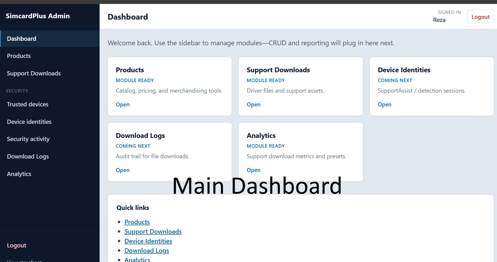
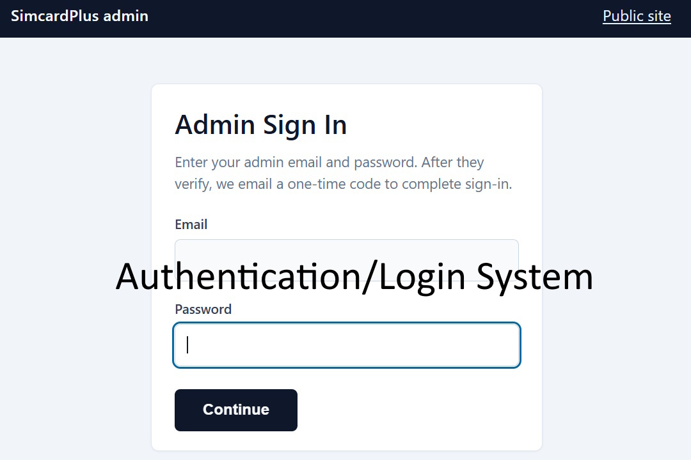
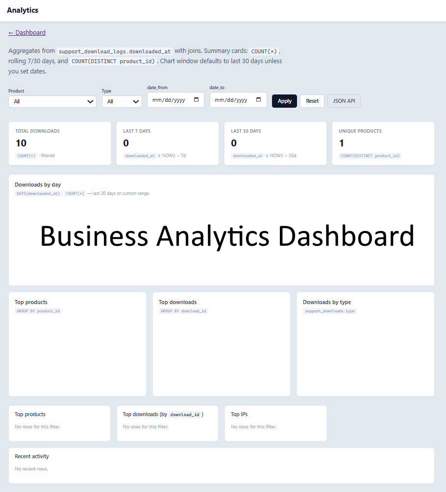

# SimcardPlus Showcase

Business platform and infrastructure showcase focused on wholesale operations, admin systems, authentication workflows, analytics dashboards, and operational tooling.

---

## Overview

SimcardPlus is a business-oriented platform designed around scalable administrative workflows, authentication systems, operational dashboards, and infrastructure-aware web architecture.

This showcase repository highlights selected UI components, dashboards, and system architecture examples without exposing production credentials, sensitive business logic, or internal deployment configurations.

---

## Core Areas

- Authentication & Login Systems
- Admin Dashboards
- Business Analytics
- Operational Workflows
- MVC-Based Architecture
- Infrastructure-Oriented Design
- Secure Administrative Interfaces

---

## Main Dashboard

---

## Authentication / Login System

---

## Business Analytics Dashboard

---

## Technology Stack

- PHP MVC Architecture
- MySQL
- JavaScript
- HTML/CSS
- Admin Workflow Systems
- Infrastructure-Oriented Web Design
- Authentication & Session Management

---

## Security Notes

This repository is intentionally structured as a public showcase repository.

The production application, credentials, infrastructure configurations, deployment secrets, API keys, and database dumps are excluded from this repository.

---

## Author

Reza Khanmohammad
Hybrid System Administrator | Infrastructure & Business Platforms | Azure & Automation
